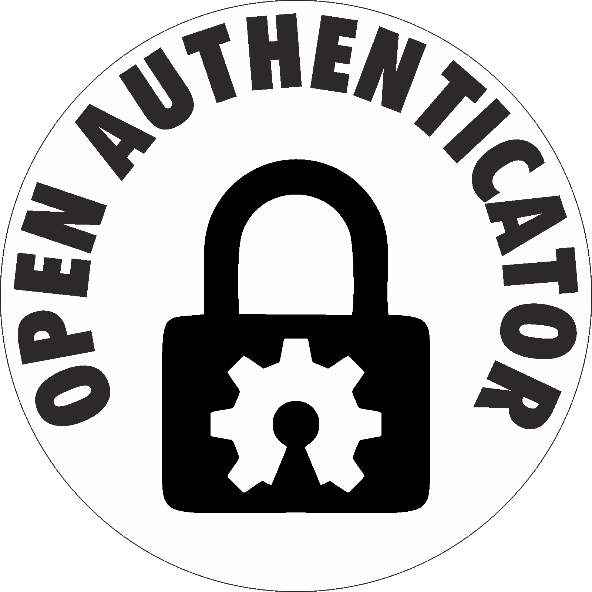

# Open Authenticator App

<br />
<p align="center">
  <a href="https://github.com/Open-Authenticator">
    
  </a>

  <p align="center">
  <b>Open Authenticator</b> is an open source TOTP based hardware <b>authenticator</b> using
  <b>ESP32</b>. This is the <b>esp-idf</b> firmware for the <a href="https://github.com/Open-Authenticator/hardware-design">custom hardware</a> built for this purpose.
    <br/>
    <!-- <br/>
    <a href="https://simppru.readthedocs.io/en/latest/"><strong>Explore the docs »</strong></a>
    <br /> -->
    <a href="https://github.com/Open-Authenticator/open-authenticator-app/issues">Report Bug</a>
    .
    <a href="https://github.com/Open-Authenticator/open-authenticator-app/issues">Request Feature</a>
    ·
    <a href="https://github.com/Open-Authenticator/open-authenticator-app/pulls">Send a Pull Request</a>
  </p>
</p>

<p align="center">


</p>

## Requirements

* *ESP-IDF* **v4.2** (*release/v4.2*)
* Open-Authenticator board
* USB-UART convertor board (to flash firmware)

Install instructions are available
[here](https://docs.espressif.com/projects/esp-idf/en/latest/esp32/get-started/).
Make sure to install `v4.2` (step 2 in the given link).

## Usage

* `/oa_store/wifi.json` contains the default wifi ssid configured after flashing
firmware

```json
{"c":1,"s":["D-Link"],"p":["vdp30022"]}
```

It is a json string, `c` key represents number of wifi added, `s` is a list of
the ssid added and `p` is a list of passwords matching the array index of the
ssid names in `s`.

* `/oa_store/totp_key.json` contains the detault totp keys added while flashing
  firmware, used for testing.

```json
{"c":2,"a":["Test-1", "Test-2"],"k":["JBSWY3DPEHPK3PXP", "DFSWY3DPEHPK3AXP"]}
```

It is a json string, `c` key represents number of totp keys added , `a` is a list of
the key aliases added and `k` is a list of totp keys matching the array index of the
ssid names in `s`. One can verify the generated OTP by adding the test keys to
[this site](https://totp.danhersam.com/)

## Compile firmware

```bash
git clone --recurse-submodules https://github.com/Open-Authenticator/open-authenticator-app.git
cd open-authenticator-app
# activate esp-idf environment (get_idf)
get_idf
idf.py build
```

## Flash firmware

### 1) Connect USB-UART to open-authenticator UART port
```
connect as follows

USB-UART----|== RX ==> --- <== TX ==|----Open Authenticator UART port
            |                       |  
            |== TX ==> --- <== RX ==|
``` 


**It should look like this after being connected**


### 2) Connect USB Type-C to power the board

* It is necessary to power the board using usb while flashing firmware. Both the
usb to uart convertor and open authenticator board must be powered by same power
source, as we haven't connected ground of the convertor to that of board. 
* If one wants to flash without powering it up with usb, connect ground of usb-uart
convertor to the shield of the usb-c port.

### 3) Put board in download mode

* While board is powered on, press `BOOT/SELECT` button, and
  simultaneously press `RESET` button. Leave the `BOOT/SELECT` button after a
  few seconds.

### 4) Flash firmware

```bash
idf.py flash
```

After it successfully flashes, press `RESET` and see it come to power, use the
buttons to navigate and use it.


## License

```
MIT License

Copyright (c) 2020 Open-Authenticator

Permission is hereby granted, free of charge, to any person obtaining a copy
of this software and associated documentation files (the "Software"), to deal
in the Software without restriction, including without limitation the rights
to use, copy, modify, merge, publish, distribute, sublicense, and/or sell
copies of the Software, and to permit persons to whom the Software is
furnished to do so, subject to the following conditions:

The above copyright notice and this permission notice shall be included in all
copies or substantial portions of the Software.

THE SOFTWARE IS PROVIDED "AS IS", WITHOUT WARRANTY OF ANY KIND, EXPRESS OR
IMPLIED, INCLUDING BUT NOT LIMITED TO THE WARRANTIES OF MERCHANTABILITY,
FITNESS FOR A PARTICULAR PURPOSE AND NONINFRINGEMENT. IN NO EVENT SHALL THE
AUTHORS OR COPYRIGHT HOLDERS BE LIABLE FOR ANY CLAIM, DAMAGES OR OTHER
LIABILITY, WHETHER IN AN ACTION OF CONTRACT, TORT OR OTHERWISE, ARISING FROM,
OUT OF OR IN CONNECTION WITH THE SOFTWARE OR THE USE OR OTHER DEALINGS IN THE
SOFTWARE.
```